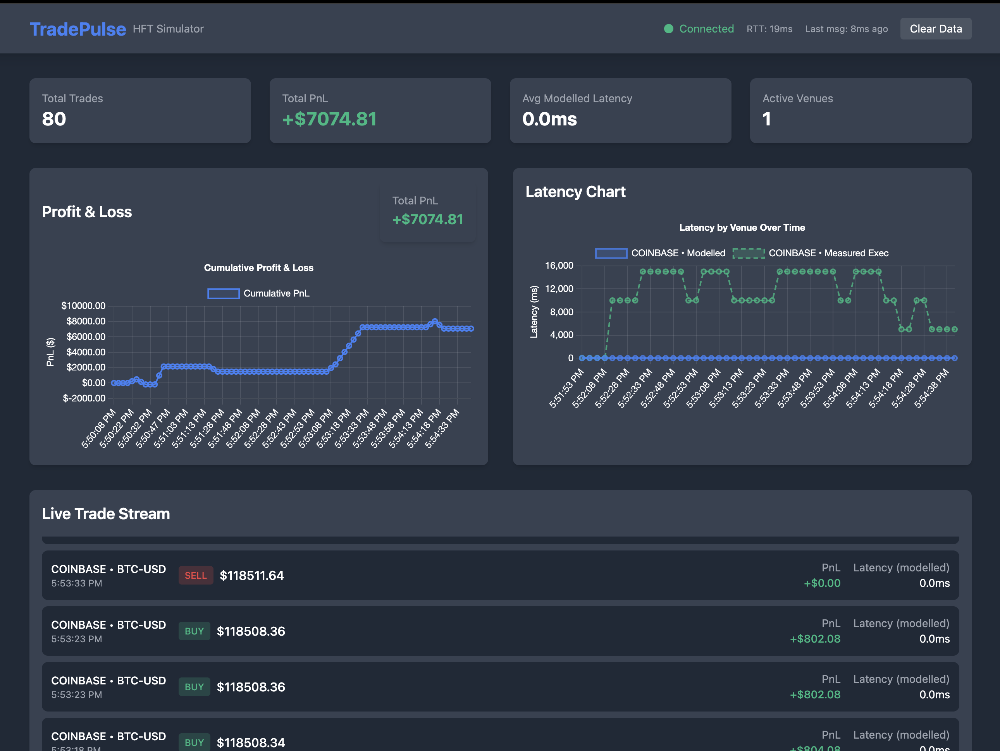

## TradePulse

**What TradePulse is**

A real‑time trading simulator and dashboard. It can consume live crypto trades (Coinbase), synthetic ticks, or replayed data; run pluggable strategies; execute orders through a single latency‑gated path; and stream executions to a Next.js dashboard.

### Preview



### Data flow (live or synthetic)

- Tick arrives (live WebSocket or synthetic generator) → normalized `MarketTick {venue, symbol, price, size, exchange_recv_ts_ms, ingest_ts_ms}`.
- Strategy processes tick → emits `Order` via `on_order({id, venue, symbol, side, price, quantity, order_created_ts_ms})`.
- Latency gate (if modelled or both): delays callback by venue latency; measured path bypasses delay.
- `OrderBook.submitOrder` → fills immediately at current price; updates positions/PnL; stamps `order_executed_ts_ms`.
- Backend broadcasts a JSON trade message with measured/modelled fields; dashboard renders it.

### Strategies (`backend/strategies/`)

- **momentum**: buys/sells on monotonic streaks over lookback.
- **mean_reversion**: revert to rolling mean.
- **breakout**: trades channel breakouts (rolling high/low).
- **vwap_reversion**: revert to rolling VWAP (price×size).
- **macd**: EMA(12/26) with 9‑period signal; trade on histogram sign.
- **rsi**: buy RSI<30, sell RSI>70 (period configurable).
- **bollinger**: buy below lower band, sell above upper (period, k).

### Modes

- `--latency_mode=measured`: no artificial delay; “real only”.
- `--latency_mode=modelled`: simulated only.
- `--latency_mode=both`: simulated path + measured stamps.

### How to run (macOS)

- **Prereqs**: `brew install cmake openssl boost`; Node.js 18+

- **Backend build**:

```bash
mkdir -p backend/build && cd backend/build && cmake .. && make -j
```

### CLI options

- **--source=synthetic|live|replay** (default: `synthetic`)
- **--exchange=coinbase|binance** (default: `coinbase`)
- **--symbol=SYMBOL** (default: `BTC-USD`)
- **--replay_file=PATH** (default: `./ticks.ndjson`)
- **--replay_speed=FLOAT** (default: `1.0`)
- **--latency_mode=measured|modelled|both** (default: `both`)
- **--modelled_latency_ms=VENUE:ms[,VENUE:ms...]**
  - Example: `--modelled_latency_ms=SYNTH:20,COINBASE:30,LSE:70`
  - If omitted, defaults are `SYNTH:20`, `COINBASE:30`, `LSE:70`.
- **--strategy=NAME** (default: `momentum`)
  - Examples: `momentum`, `mean_reversion`, `breakout`, `vwap_reversion`, `macd`, `rsi`, `bollinger`.
- **--lookback=INT** (default: `3`)
- **--order_qty=INT** (default: `100`)

### Examples

```bash
# Synthetic
./tradepulse --source=synthetic --strategy=momentum --lookback=3 --order_qty=100 --latency_mode=measured

# Live (Coinbase)
./tradepulse --source=live --exchange=coinbase --symbol=BTC-USD --strategy=breakout --lookback=20 --order_qty=50 --latency_mode=measured
```

- **Frontend**:

```bash
cd frontend && npm i && npm run dev
# → http://localhost:3000
```

### Contributing

Contributions are welcome! Feel free to open Issues and Pull Requests.

### License

This project is licensed under the terms of the license in the `LICENSE` file.
